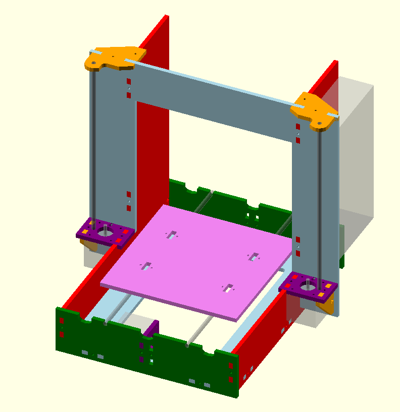

# parametric-graber

An unproven, experimental, parametric implementation of the graber printer.  See [the original](https://github.com/sgraber/Graber) or [my modified version](https://github.com/elliotf/Graber/tree/24x18_layout/24x18) in the meantime if you're interested in a working printer.

# Why?

* Because really, who doesn't want a 6"x6" graber with nema14 motors?
* I grew tired of manually editing vector files in inkscape

# Still left TODO:

* Add printed parts
* Make sure nozzle can reach min,max build y
* Spool mount
* Make cut files
* Check parametric-ness of 6mm rods
* Check parametric-ness of 6x6x6 build volume
* Check parametric-ness of NEMA14 motors (mostly Y idler is the problem)
* Improve parametric-ness of fasteners (frame, y rod retainer, make it easy to change)
* Make BOM, possibly generate from scad a la nophead (praised be his name!)
* 6x6x6 printer with nema17 has y bearings that hit Y motor
* Allow non-square Y carriage
* Allow three-bearing Y carriage
