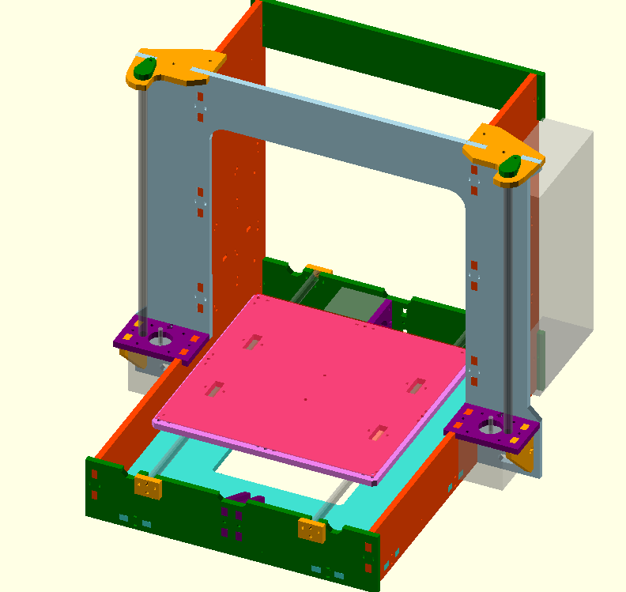

# parametric-graber

An unproven, experimental, parametric implementation of the graber printer.  See [the original](https://github.com/sgraber/Graber) or [my modified version](https://github.com/elliotf/Graber/tree/24x18_layout/24x18) in the meantime if you're interested in a working printer.

# Why?

* Because really, who doesn't want a 6"x6" graber with nema14 motors?
* I grew tired of manually editing vector files in inkscape
